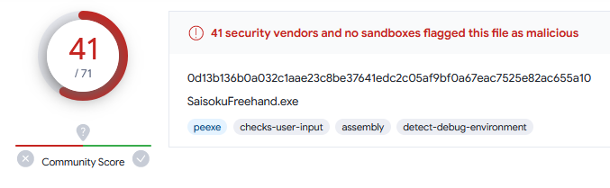

# 最速フリーハンド
 
画面上に線や図を最速で描くためのソフトウェアです。起動後すぐに描画できます。

## 使用例

マウスで描画します。カメラボタンでクリップボードに画像をコピーすることもできます。終了する場合は、終了ボタンを押します。  

  

**複数の描画ツール**  
フリーハンドだけでなく四角や矢印、文字などを描くこともできます。また、Shiftを押しながら描画することで正方形を描いたり、45度単位で線を描くことができます。  

  

**ダブルクリックで描画をクリア**  
マウスをダブルクリックすることで線をクリアできます。下記の例では丸を描いた後にダブルクリックをしています。  

  

**キャプチャツールとして**  
設定を変えることでキャプチャしたものを自動保存できます。またShiftを押しながら起動すると保存先を開きます。下記の例では最後にShiftキーを押しながらタスクバーのアイコンをクリックしています。  

  

## 動作確認環境
Microsoft Windows10 x64 + .NET Framework 4.8

## ライセンス

This software is released under the MIT License.  
詳細については、[LICENSE](./LICENSE) ファイルを参照してください。

## その他

[VirusTotal](https://www.virustotal.com/gui/home/upload)での[スキャン結果](https://www.virustotal.com/gui/file/0d13b136b0a032c1aae23c8be37641edc2c05af9bf0a67eac7525e82ac655a10/detection)です。悪意のあるプログラムと判定されます。故意に作成しているわけではないため、問題ないとは思いますが、原因不明のため実際に問題がある可能性があります。  

  
